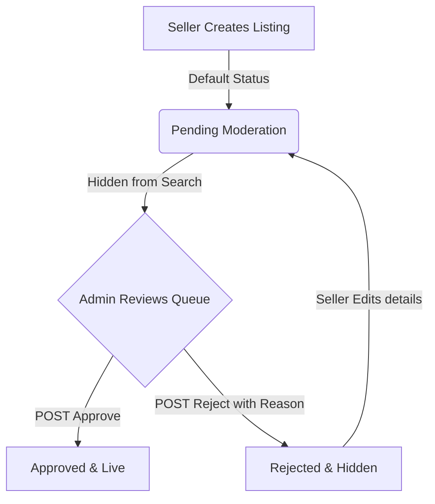

# PropVista — Real Estate Operating System

PropVista is a premium, SaaS-grade Real Estate Operating System and CRM built using Python and Django. Designed with an elegant, responsive glassmorphic UI, it streamlines interactions between property buyers, sellers, and administrators through real-time dashboards, signal-driven notifications, and rich database-backed analytics.

---

## 1. Project Overview
PropVista acts as a centralized intelligence layer for luxury property listings and transactions. The platform enforces strict role-based workspaces (Buyer, Seller, and Admin), a secure moderation pipeline for new listings, integrated communication tools, and detailed visual dashboards tracking views, inquiries, and platform metrics.

---

## 2. Key Features
* **Role-Based Workspaces:** Context-aware navigation and features tailored for Buyers, Sellers, and Administrators.
* **Property Search Engine:** Deep query searching with multi-attribute filtering (keywords, location, price ranges, property specifications).
* **Listing Moderation:** Multi-state approval workflow that secures the database from unmoderated listings.
* **Lead Pipeline CRM:** Kanban-style pipeline tracking for managing buyer inquiries through conversion.
* **Finance tools:** Dynamic client-side mortgage calculator estimating monthly payments in real time.
* **Real-time Notifications:** Signal-driven header inbox highlighting listing updates, user shortlists, and inquiries.
* **Activity Analytics:** Tracks visitor referrers, page views, audit actions, and user growth trends.
* **Leaflet Maps Integration:** Interactive geo-spatial property mapping powered by Leaflet.js and OpenStreetMap.

---

## 3. Tech Stack
* **Backend Framework:** Django 5.0.14
* **Database Engine:** SQLite 3 (configured with high-performance indices on lookup columns)
* **Frontend Design:** HTML5, Vanilla CSS3 (custom CSS variables theme with glassmorphism layouts), Bootstrap 5.3.3
* **Interactive Scripts:**
  * **Leaflet.js:** Geo-mapping coordinates on OpenStreetMap layers
  * **Chart.js:** Dynamic seller and admin dashboard analytics charts
  * **Three.js & GSAP:** Homepage ambient skyline animations and element transitions
  * **Swiper.js:** Media galleries and carousels
  * **Vanilla-Tilt.js:** Elegant card interactions

---

## 4. Workspaces & Workflows

### Buyer Workflow
1. **Browse & Search:** Buyers search properties using the header query drop-down or the main search page. Filters support keyword matches, city/locality names, price thresholds, property types, and bedroom/bathroom configurations.
2. **Wishlist (Favorites):** Click the heart icon on any listing card to toggle it on/off the personal wishlist. Changes are persisted in the database via AJAX.
3. **Inquiry Submission:** Submit an inquiry form directly on the property details sidebar.
4. **Activity Monitoring:** Access the Buyer Dashboard to view active inquiries status, saved properties, and recent inbox notifications.

### Seller Workflow
1. **Interactive Dashboard:** Monitors listing views over the last 7 days via a line chart, and inquiry conversion stages (New, Contacted, Qualified, Closed) via a doughnut chart.
2. **Create Listings:** Add new properties by inputting metadata and uploading a cover image plus 4 gallery photos (5 images total). Filenames are sanitized on upload (<50 characters, special character removal) to protect the filesystem.
3. **Property Performance:** A detailed grid showing distinct page views, wishlisted count, and inbound inquiries for each property.
4. **CRM Inquiry Pipeline:** A card-based pipeline tracking inbound leads to help sellers convert inquiries into deals.
5. **Edit & Delete Listings:** Update listing details (resets status to `PENDING` validation) or delete them.

### Admin Workflow
1. **Platform Command Center:** Monitors system-wide users count, total listings, total portfolio valuation, city distribution, and user registration growth rates.
2. **Property Approvals:** Centralized moderation interface displaying all pending, approved, and rejected listings.
3. **System Audits:** Interactive timeline rendering `AuditLog` records containing the actor, model mutation, metadata, and timestamps.
4. **Reports:** PDF/Excel generation routes for executive audits, detailing city-by-city market density, conversion metrics, and top-performing properties.

---

## 5. System Architecture

### Property Approval Workflow
To maintain high data quality, listings are moderated through a strict validation flow:
1. When a seller creates a listing or modifies an existing one, its status defaults to `PENDING` approval.
2. The property is hidden from all public searches and listings.
3. The listing appears in the Admin's moderation queue.
4. The Admin can:
   * **Approve:** Transitions the property to `APPROVED` and `ACTIVE` status. The property immediately goes live on the marketplace.
   * **Reject:** Transitions the property to `REJECTED`. The Admin must specify a reason (e.g., "Invalid pricing"), which is logged and shown to the seller.
5. **Security Hardening:** All moderation actions require POST requests with CSRF validation. Direct GET actions to approval URLs are prohibited (`405 Method Not Allowed`).



### Inquiry Pipeline
Inquiries submitted by buyers are converted into actionable leads for the seller:
* A buyer submits the inquiry form on a listing detail page.
* The system logs the inquiry and fires a Django signal dispatching a notification alert to the listing owner.
* The inquiry is mapped to the seller's CRM Pipeline, transitioning through:
  `New` ➔ `Contacted` ➔ `Qualified` ➔ `Closed`

### Notifications System
PropVista features a centralized signal-driven notification framework:
* Triggers on key actions (e.g., property approval, new inquiries, user wishlist additions).
* Dispatches database records linked to target users.
* Unread counts are computed dynamically via context processors and badge alerts are updated on the global navigation navbar.
* Includes mark-all-read AJAX functionality.

### Analytics & Reports
* **View Tracking:** A custom middleware/view listener captures property details visits. It logs a `PropertyViewEvent` including the user (if authenticated), target property, referrer domain, and timestamp.
* **Audit Trails:** Tracks critical mutations on database records, compiling an audit history of who mutated which object and when.
* **Report Generator:** Pulls database records to compute platform conversion stats and returns downloadable reports.

---

## 6. Leaflet Maps
Leaflet.js integrates with OpenStreetMap to provide geographic visualizations without third-party API keys:
* Maps render in the main listing view and the property details page.
* Coordinates (Latitude, Longitude) configured on the property model dynamically place markers.
* Clickable popups showcase listing details, price, and thumbnail images.

---

## 7. Finance Calculator
A client-side mortgage EMI calculator is built directly into the property details sidebar:
* **Inputs:** Property Price, Down Payment %, Annual Interest Rate, and Loan Tenure.
* **Dynamic Outputs:** Calculates Loan Amount, Monthly EMI, Total Interest, and Cumulative Payments.
* Computations update in real-time as users slide or input values.

---

## 8. Directory Structure

```text
E:\PropVista_Final\
├── accounts/          # Registration, Profile configuration, and user roles
├── analytics/         # PropertyViewEvent logger and AuditLog configurations
├── archive/           # Decommissioned apps or unused templates
├── favorites/         # Wishlist bookmarking and AJAX toggle view handlers
├── inquiries/         # Buyer-to-seller message templates and pipeline
├── leads/             # CRM Kanban board lead conversions
├── media/             # Uploaded cover images, gallery photos, and user avatars
├── notifications/     # Signal-driven notifications database and views
├── properties/        # Listings, Category/Amenity objects, and approvals moderations
├── propvista/         # Django project base (settings, urls, context router)
├── reports/           # Analytical charts, performance audits, and CSV data models
├── search/            # Keyword searches and history logs
├── static/            # Frontend design assets (css/app.css, js/app.js)
├── templates/         # HTML structure files (base.html, partials, dashboards)
├── tests/             # Pytest automated testing suite
└── visits/            # In-person visit scheduling models
```

---

## 9. Installation & Setup

### Prerequisites
* Python 3.12 or higher
* pip package manager

### Steps
1. **Initialize Virtual Environment:**
   ```bash
   python -m venv venv
   ```
2. **Activate Virtual Environment:**
   * **Windows:**
     ```powershell
     venv\Scripts\activate
     ```
   * **macOS/Linux:**
     ```bash
     source venv/bin/activate
     ```
3. **Install Dependencies:**
   ```bash
   pip install -r requirements.txt
   ```
4. **Run Migrations:**
   ```bash
   python manage.py migrate
   ```
5. **Seed Database:**
   Populates the SQLite3 database with pre-configured categories, amenities, listings, and demo users.
   ```bash
   python manage.py seed
   ```
6. **Start Dev Server:**
   ```bash
   python manage.py runserver
   ```
   Access the local application at: `http://127.0.0.1:8000/`

---

## 10. Demo Credentials
Use these pre-seeded accounts to evaluate roles. All accounts share the same password.

* **Default Password:** `Pass@12345`

| Username | Role | Dashboard Scope |
| :--- | :--- | :--- |
| `buyer` | Buyer | Wishlist monitoring, inquiry creation, site visits. |
| `seller` | Seller | Listing editor, gallery uploads, performance analytics, CRM pipeline. |
| `admin` | Admin | Moderation panel, system-wide analytics, user audit logs, reports. |
| `superadmin` | Super Admin | Full read/write access to the Django admin panel (`/admin/`). |

---

## 11. Screenshots & Placeholders

### Ambient Homepage

*Homepage showcasing the Three.js canvas animated skyline, core metrics summary, and listings rail.*

### Seller Dashboard

*Analytics charts showing property view trends, inquiry status distribution, and my properties metrics.*

### Admin Moderation Queue

*Compliance command center managing pending, approved, and rejected listings.*

---

## 12. Future Improvements
* **Payment Gateways:** Integrate Stripe or Razorpay to support paid listing upgrades or subscription tiers.
* **Proximity Alerts:** Dispatch notifications when new properties match user-configured location searches.
* **Property comparison rail:** Side-by-side spec comparison table for shortlisted listings.
