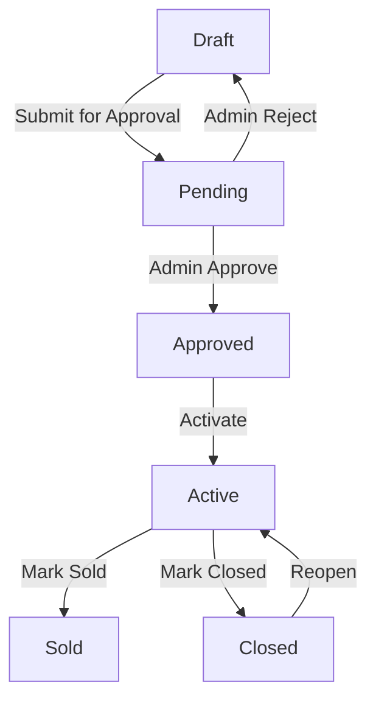

# PropVista Property Lifecycle Management Report

This report documents the implementation and verification of the new **Property Lifecycle Management** system in PropVista, detailing status definitions, state transitions, access controls, buyer listing visibility rules, dashboards, analytics views, and testing validation.

---

## 1. Property Lifecycle Statuses

PropVista now tracks properties across six distinct stages, ensuring a secure and structured listing flow from creation to completion:

| Status | Description | Public Visibility |
|---|---|---|
| **Draft** | Newly created property, editable by the seller. | Hidden |
| **Pending** | Submitted by the seller, awaiting administrator approval. | Hidden |
| **Approved** | Approved by the administrator, ready for the seller to make active. | Hidden |
| **Active** | Live on the marketplace, discoverable in default buyer searches. | Visible |
| **Sold** | Markedly completed transaction, displays a `SOLD` badge. | Visible (via explicit Sold filter) |
| **Closed** | De-listed property, hidden from public views. | Hidden |

---

## 2. State Transition Flow

Properties progress through a controlled state machine:

*   **Create to Approve:** Sellers create properties in **Pending** (or **Draft**). Admin reviews and moves them to **Approved** or **Rejected** (reverts to **Draft**).
*   **Approve to Active:** Sellers activate the approved property, making it live for buyers.
*   **Active to Sold/Closed:** Sellers mark active properties as **Sold** when a deal is closed, or **Closed** to temporarily/permanently withdraw the listing.
*   **Reopen:** Sellers can reopen **Closed** listings back to **Active** status.

---

## 3. Permissions Matrix

Role-based access control (RBAC) governs the actions available at each lifecycle state:

| Role | Submit Draft | Approve/Reject | Mark Active as Sold | Mark Active as Closed | Reopen Closed |
|---|---|---|---|---|---|
| **Seller** (Owner) | Yes | No | Yes | Yes | Yes |
| **Admin** | Yes | Yes | Yes (Override) | Yes (Override) | Yes (Override) |
| **Buyer** | No | No | No | No | No |

---

## 4. Buyer Experience & Search Visibility

### A. Listing Visibility Rules
*   **Public Listings:** Only properties with `approval_status = APPROVED` and `status` in `[ACTIVE, SOLD]` are exposed to the public queryset.
*   **Default Search:** By default, buyer listings filter out `SOLD` properties, rendering only `ACTIVE` properties.
*   **Explicit Sold Queries:** Buyers can specifically toggle/search for `SOLD` properties, which display an prominent `SOLD` badge overlay.
*   **Closed Properties:** Properties in `CLOSED`, `DRAFT`, `PENDING`, or `APPROVED` states are strictly blocked and raise a `404 Not Found` if accessed directly by unauthenticated users or unauthorized roles.

### B. Property Details Page
*   **Interactive Timeline:** Shows current status highlighting the journey: `Draft -> Pending -> Approved -> Active -> Sold`.
*   **Sold Date:** Displays the exact date of sale on the timeline if the property is in the `Sold` state.

---

## 5. Dashboards & Reports

### A. Seller Dashboard
The Seller Dashboard summarizes listings in real-time with dedicated counters:
*   **Active Count:** Total active listings currently live on the platform.
*   **Pending Count:** Listings awaiting administrator approval.
*   **Sold Count:** Completed listings.
*   **Closed Count:** Delisted listings.

### B. Reports & Portfolio Intelligence
The Admin/Seller Reports section calculates aggregate lifecycle performance:
*   **Total Active:** Total live properties on the platform.
*   **Total Sold:** Cumulative count of transactions completed.
*   **Total Closed:** Cumulative count of closed listings.
*   **Sales Conversion Rate:** Calculated dynamically using:
    $$\text{Sales Conversion Rate} = \frac{\text{Total Sold}}{\text{Total Active} + \text{Total Sold} + \text{Total Closed}} \times 100$$

---

## 6. Automated Flow Verification

The lifecycle flow is verified by automated integration tests located in [test_new_features.py](file:///E:/PropVista_Final/tests/test_new_features.py):

*   **Test Case:** `test_property_lifecycle_workflow`
*   **Scope:** Verifies the full workflow sequence:
    1.  **Create:** Seller creates property (asserts status is `PENDING`).
    2.  **Approve:** Admin approves property (asserts status is `APPROVED`, asserts hidden from public listing).
    3.  **Active:** Seller activates property (asserts status is `ACTIVE`, asserts public search shows property).
    4.  **Sold:** Seller marks active property as sold (asserts status is `SOLD`, asserts `sold_date` is populated, asserts `SOLD` badge renders in list).
    5.  **Closed:** Seller marks active property as closed (asserts status is `CLOSED`, asserts property hidden from public listing).
    6.  **Reopen:** Seller reopens closed property (asserts status returns to `ACTIVE`).
    7.  **Reports:** Verifies Reports & Analytics view renders the lifecycle metrics and conversion rates correctly.

---

## 7. Implementation Files Reference

*   **Models Definition:** [properties/models.py](file:///E:/PropVista_Final/properties/models.py)
*   **Status Transitions & Actions:** [properties/views.py](file:///E:/PropVista_Final/properties/views.py)
*   **Dashboards & Analytics:** [accounts/views.py](file:///E:/PropVista_Final/accounts/views.py) and [reports/views.py](file:///E:/PropVista_Final/reports/views.py)
*   **Visual Layouts:** [detail.html](file:///E:/PropVista_Final/templates/properties/detail.html), [property_card.html](file:///E:/PropVista_Final/templates/partials/property_card.html), [reports.html](file:///E:/PropVista_Final/templates/dashboards/reports.html)
